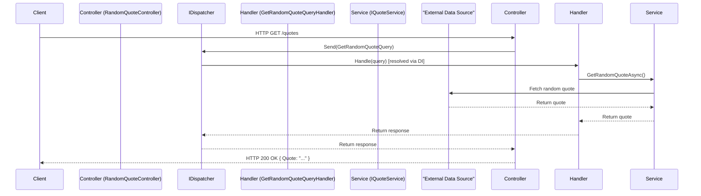
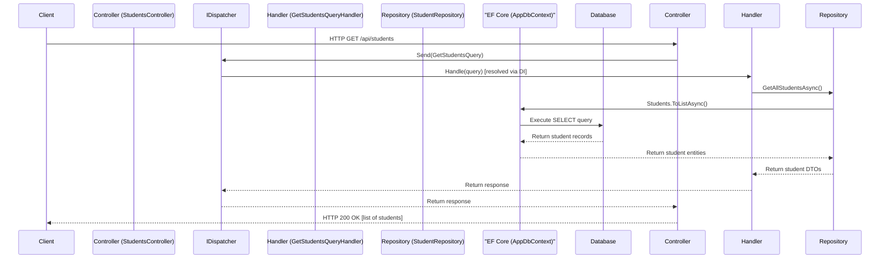

# Application Architecture Flow

This Mermaid sequence diagram illustrates the high-level flow for a typical request in the LearnEFCore application, such as fetching a random quote via the `/quotes` endpoint.

## Explanation
- **Client**: The external user or application making the HTTP request.
- **Controller**: Handles routing and delegates the request to the dispatcher.
- **IDispatcher**: Mediates by resolving and invoking the appropriate handler via dependency injection. Uses marker interfaces like `IQuery<TResponse>` and `ICommand` for type safety and handler routing.
- **Handler**: Processes the query and orchestrates business logic.
- **Service**: Abstracts data access or external interactions.
- **Database/External**: Represents data sources like files or databases.

This diagram shows the CQRS-inspired flow, promoting separation of concerns and testability.

---

## Students Endpoint Flow (Using EF Core and Database)

This diagram shows the flow for a read operation on the students endpoint, such as `GET /api/students`, which retrieves all students from the database using Entity Framework Core.

## Explanation for Students Flow
- **Client**: Makes the HTTP request to fetch students.
- **Controller**: Routes the request and sends the query via the dispatcher.
- **IDispatcher**: Resolves and calls the query handler.
- **Handler**: Uses the repository to fetch data and maps entities to DTOs.
- **Repository**: Abstracts database operations using EF Core.
- **EF Core (AppDbContext)**: ORM layer that translates LINQ queries to SQL and manages the database connection.
- **Database**: The PostgreSQL database storing student data.

This highlights how EF Core integrates with the CQRS pattern for data access.